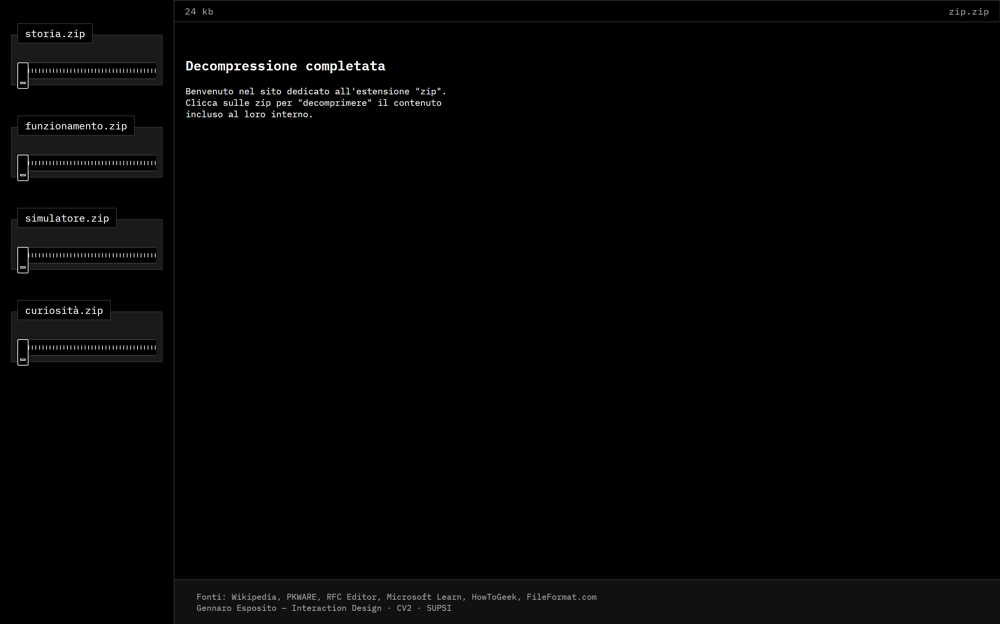
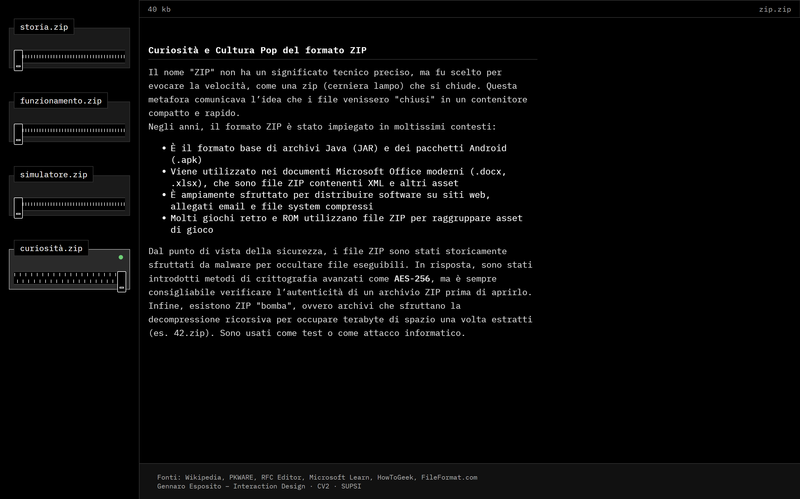
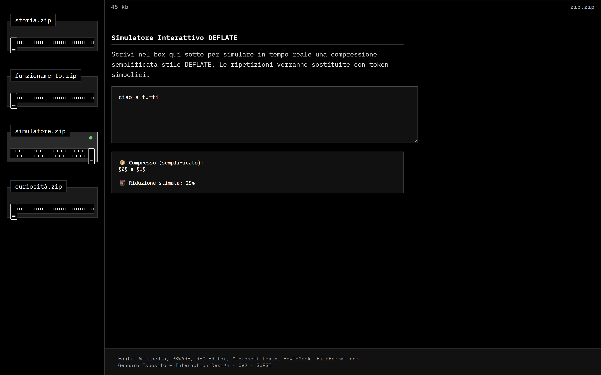

<<<<<<< HEAD
SUPSI 2025  
Corso d’interaction design, CV428.01  
Docenti: A. Gysin, G. Profeta  

Elaborato 1: zip.zip

# zip.zip  
Autore: Gennaro Esposito  
🔗 [https://gennespo.github.io/zip.zip/](https://gennespo.github.io/zip.zip/)

## Introduzione e tema

zip.zip è un sito interattivo che spiega il funzionamento del formato di compressione ZIP, simulando in tempo reale l’apertura e l’estrazione di contenuti da un archivio compresso. Il progetto è nato con l’idea di unire rigore tecnico e narrazione visuale, restituendo un’esperienza che fosse al tempo stesso educativa e ludica.  
Ogni sezione rappresenta una “cartella ZIP” dotata di una cerniera animata che, una volta cliccata, mostra il contenuto “decompresso” in un pannello laterale.

Il sito gioca con la metafora del file ZIP per introdurre i concetti di compressione, struttura dei dati, peso digitale e packaging delle informazioni.

## Riferimenti progettuali

Il progetto si basa su:

- documentazione ufficiale sul formato ZIP (Info-ZIP, PKZIP, e specifiche .ZIP su Wikipedia)
- ispirazione visiva dalle interfacce classiche di Windows delle icone ZIP
- esplorazioni interattive ispirate ad alcune di quelle viste nei progetti, in fase di ricerca, di alcuni siti di creative coding

## Design dell’interfaccia e modalità di interazione

L’interfaccia è divisa in due aree principali:
- una **sidebar a sinistra**, con una lista di sezioni rappresentate come cartelle ZIP animate
- un **blocco principale a destra**, dove il contenuto viene "decompresso" dinamicamente con animazioni a cascata

Durante il caricamento iniziale avviene una decompressione globale con barra di avanzamento e comparsa graduale degli elementi (titolo, contatore di peso, footer).

Ogni cartella è apribile singolarmente e mostra contenuti testuali con effetto a cascata. L'interazione è pensata per simulare l'espansione del contenuto digitale, mantenendo sempre visibile un contatore dinamico del peso del sito (in kb), che cambia in base all’interazione dell’utente.

## Tecnologia usata

Il sito è stato sviluppato in **HTML**, **CSS** e **JavaScript**, con animazioni gestite via JavaScript e CSS transitions.

Caratteristiche tecniche:
- decompressione simulata tramite funzioni di delay, transizioni e `setTimeout`
- sistema di zip animata con denti e cursore mobile sincronizzato
- interfaccia dinamica con eventi click per l’apertura delle cartelle
- contatore dinamico del peso del sito aggiornato in base alle interazioni
- simulatore di compressione testuale con analisi e sostituzione di pattern ripetuti

Ecco un estratto della funzione che simula la compressione del testo nel sito:

```JavaScript
if (event.target.id === 'deflateInput') {
  const content = event.target.value;
  let compressed = content;

  const patterns = [...new Set(content.match(/\b\w{4,}\b/g))]; // parole di almeno 4 lettere
  patterns.forEach((word, i) => {
    const token = `§${i}§`;
    compressed = compressed.split(word).join(token);
  });

  const reduction = content.length > 0
    ? Math.round(((content.length - compressed.length) / content.length) * 100)
    : 0;

  const display = document.getElementById('deflateCompressed');
  display.textContent =
    '📦 Compresso (semplificato):\n' + compressed +
    '\n\n🧮 Riduzione stimata: ' + reduction + '%';
}
```

## Target e contesto d’uso

zip.zip è rivolto a studenti, designer e curiosi del mondo digitale, con l’obiettivo di far comprendere in modo chiaro e visivo un concetto spesso astratto come la compressione dei file.  
Può essere utilizzato in contesti didattici o come sito divulgativo per introdurre nozioni tecniche in modo accessibile e coinvolgente.

## Media di progetto

  
  

